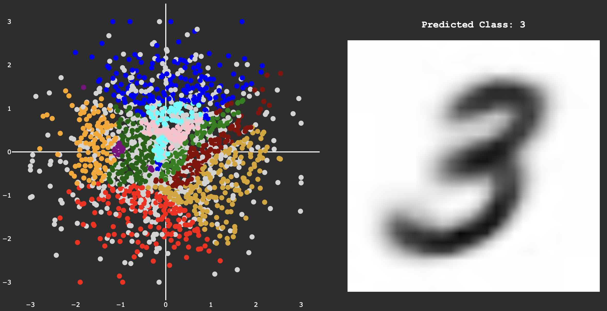

# VAE Image Generation + Tiny CNN Classifier

This project implements a Variational Autoencoder (VAE) for MNIST image generation and a lightweight CNN classifier for digit recognition. The system includes an interactive interface for generating and classifying handwritten digits.

## Features

- **VAE-based Image Generation**: Generate new MNIST-style handwritten digits using a trained Variational Autoencoder
- **Real-time Classification**: Classify generated or uploaded images using a lightweight CNN model
- **Interactive UI**: User-friendly interface for image generation and classification

### VAE Latent Space and Generation

*Visualization of the VAE's latent space and generated samples*

### Interactive User Interface

*Screenshot of the interactive generation and classification interface*
