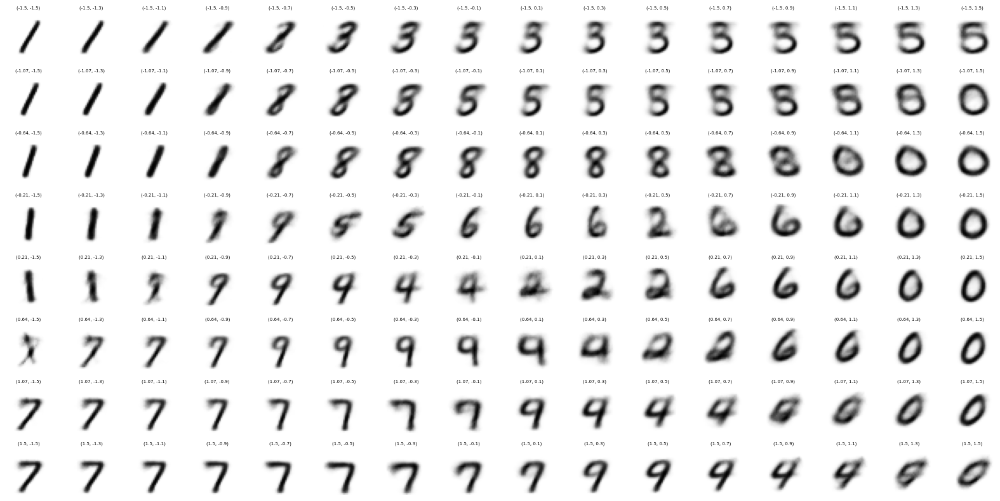

# VAE Image Generation + Tiny CNN Classifier

This project implements a Variational Autoencoder (VAE) for MNIST image generation and a lightweight CNN classifier for digit recognition. The system includes an interactive interface for generating and classifying handwritten digits.

## Features

- **VAE-based Image Generation**: Generate new MNIST-style handwritten digits using a trained Variational Autoencoder
- **Real-time Classification**: Classify generated or uploaded images using a lightweight CNN model
- **Interactive UI**: User-friendly interface for image generation and classification

### How does it work?

Basically, a VAE is a model that learns the latent space of a dataset, in this case the MNIST dataset.
The latent space is a simpler low-dimensional distribution that can be mapped to the more complex high-dimensional data.
So for us, the latent space is a 2D space of samples from a normal distribution where each point corresponds to a possible image.
In the image below, we can see how by "moving" in the latent space we slowly transition from one digit to another, with similar digits like 5 and 3 or 7 and 9 being close to each other.

*Visualization of the VAE's latent space and generated samples*
